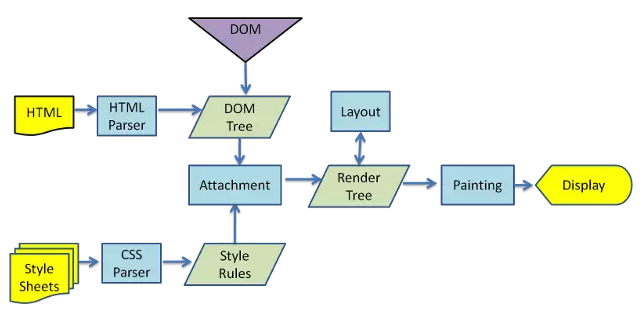
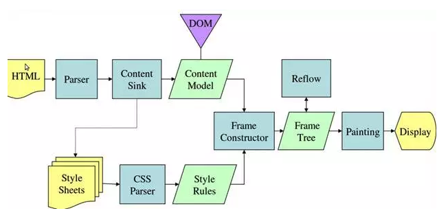
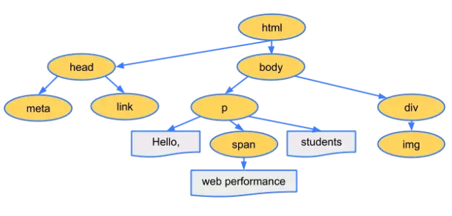
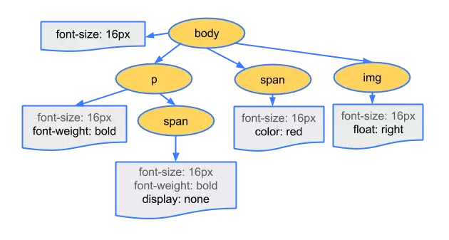

# 浏览器渲染原理

### 前言

为什么要了解浏览器的渲染原理？了解浏览器的渲染原理有什么好处？我们做前端开发为什么非要了解浏览器的原理？直接把网页做出来，什么需求，直接一把梭，撸完收工不好吗。

但是经常有人会问，什么是 **重排** 和 **重绘** ？

**重排**也叫**回流**（`Reflow`），**重绘**（`Repaint`），会影响到浏览器的性能，给用户的感觉就是网页访问慢，或者网页会卡顿，不流畅，从而使网页访问量下降。

所以，想要尽可能的避免**重排**和**重绘**，就需要了解浏览器的**渲染原理**。

### 浏览器工作流程


上图我们可以看出，浏览器会解析三个模块：

* `HTML`,`SVG`,`XHTML`，解析生成`DOM`树。
* `CSS`解析生成`CSS`规则树。
* `JavaScript`用来操作`DOM API`和`CSSOM API`，生成`DOM Tree`和`CSSOM API`。

解析完成后，浏览器会通过已经解析好的`DOM Tree` 和 `CSS`规则树来构造 `Rendering` `Tree`。

* `Rendering Tree` 渲染树并不等同于`DOM`树，因为一些像`Header`或`display:none`的东西就没必要放在渲染树中了。
* `CSS` 的 `Rule Tree`主要是为了完成匹配并把`CSS Rule`附加上`Rendering`。
* `Tree`上的每个`Element`。也就是`DOM`结点，即`Frame`。然后，计算每个`Frame`（也就是每个`Element`）的位置，这又叫`layout`和`reflow`过程。
* 最后通过调用操作系统`Native GUI`的`API`绘制。

### 不同内核的浏览器渲染



上图是`webkit`内核的渲染流程，和总体渲染流程差不多，要构建`HTML`的`DOM Tree`，和`CSS`规则树，然后合并生成`Render Tree`，最后渲染。



这个是`Mozilla`的`Gecko`渲染引擎。  
总体看来渲染流程差不多，只不过在生成渲染树或者`Frame`树时，两者叫法不一致，`webkit`称之为`Layout`，`Gecko`叫做`Reflow`。

### 渲染顺序



* 当浏览器拿到一个网页后，首先浏览器会先解析`HTML`，如果遇到了外链的`css`，会一下载`css`，一边解析`HTML`。
* 当`css`下载完成后，会继续解析`css`，生成`css Rules tree`,不会影响到`HTML`的解析。
* 当遇到`<script>`标签时，一旦发现有对`javascript`的引用，就会立即下载脚本，同时阻断文档的解析，等脚本执行完成后，再开始文档的解析。



* 当`DOM`树和`CSS`规则树已经生成完毕后，构造 `Rendering Tree`。
* 调用系统渲染页面。

### 什么情况会造成重排和重绘

**重排**意味着元件的几何尺寸变了，我们需要重新验证并计算`Render Tree`。是`Render Tree`的一部分或全部发生了变化。这就是`Reflow`，或是`Layout`。

**重排**因为要重新计算`Render Tree`，而且每一个`DOM Tree`都有一个`reflow`方法，一旦某个节点发生**重排**，就有可能导致子元素和父元素甚至是同级其他元素的`reflow`，浪费大量的时间重新验证`Render Tree`。

因此，**重排**的成本要比**重绘**高很多。

以下操作会导致**重排**或**重绘**。

* 删除，增加，或者修改`DOM`元素节点。
* 移动`DOM`的位置，开启动画的时候。
* 修改`CSS`样式，改变元素的大小，位置时，或者将使用`display:none`时，会造成**重排**；修改`CSS`颜色或者`visibility:hidden`等等，会造成**重绘**。
* 修改网页的默认字体时。
* Resize窗口的时候（移动端没有这个问题），或是滚动的时候。
* 内容的改变，\(用户在输入框中写入内容也会\)。
* 激活伪类，如:hover。
* 计算`offsetWidth`和`offsetHeight`。

如果当前网页含有一些动画，或者固定不动元素的网页时，由于滚动也会发生**重排**，一旦发生滚动，当前浏览器所承受的压力很大，就会造成网页的卡顿，掉帧等情况。

```text
var bstyle = document.body.style; // cache
 
bstyle.padding = "20px"; // reflow, repaint
bstyle.border = "10px solid red"; //  再一次的 reflow 和 repaint
 
bstyle.color = "blue"; // repaint
bstyle.backgroundColor = "#fad"; // repaint
 
bstyle.fontSize = "2em"; // reflow, repaint
 
// new DOM element - reflow, repaint
document.body.appendChild(document.createTextNode('dude!'));
```

以上逻辑，几乎每一步都会造成**重排**或**重绘**，如果浏览器像这样处理的话，可能现代的浏览器没有我们使用的那么流畅了。  
 因此浏览器有一个机制，会把需要**重排**或**重绘**的先积累着，然后一次性进行**重排**和**重绘**。

当然，不是所有的情况浏览器都是这样处理的，比如`resize`或者修改默认字体，对于这些操作，浏览器会立马进行**重排**。

### 如何减少重排和重绘

* 尽量避免`style`的使用，对于需要操作`DOM`元素节点，重新命名`className`，更改`className`名称。
* 如果增加元素或者`clone`元素，可以先把元素通过`[documentFragment](https://developer.mozilla.org/zh-CN/docs/Web/API/DocumentFragment)`放入内存中，等操作完毕后，再`appendChild`到`DOM`元素中。
* 不要经常获取同一个元素，可以第一次获取元素后，用变量保存下来，减少遍历时间。
* 尽量少使用`dispaly:none`，可以使用`visibility:hidden`代替，`dispaly:none`会造成**重排**，`visibility:hidden`会造成**重绘**。
* 不要使用`Table`布局，因为一个小小的操作，可能就会造成整个表格的**重排**或**重绘**。
* 使用`resize`事件时，做**防抖**和**节流**处理。
* 对动画元素使用`absolute / fixed`属性。
* 批量修改元素时，可以先让元素脱离文档流，等修改完毕后，再放入文档流。

### 

